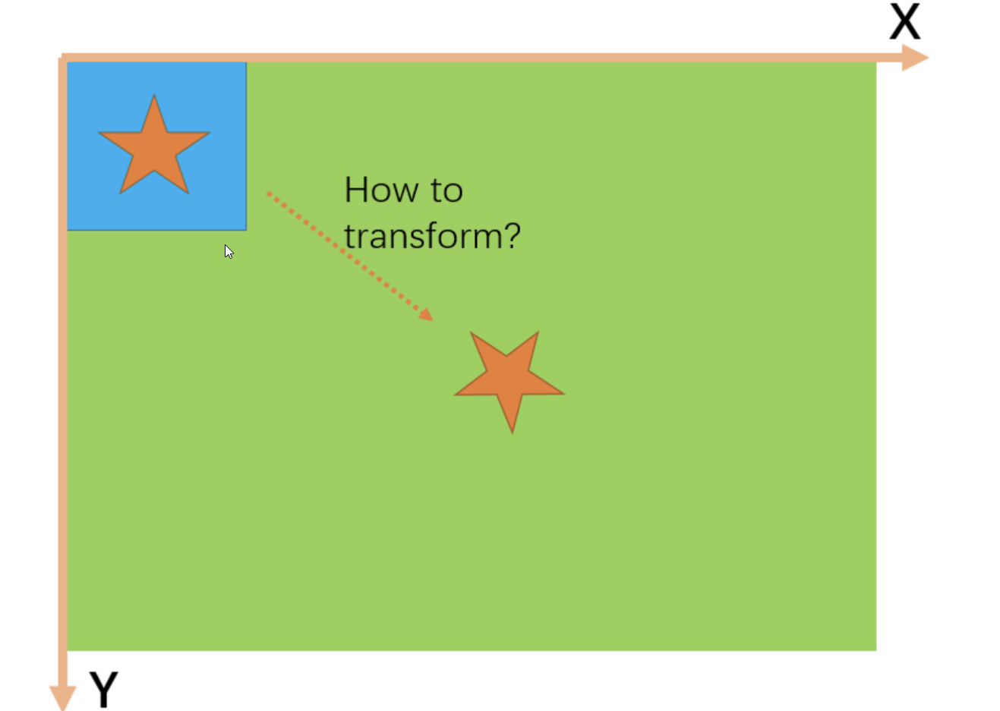
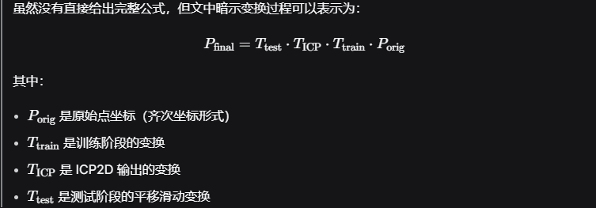

# 🧠 一、核心目标
基于形状匹配的目标是找到一个[3*3]变换矩阵，该矩阵能将训练图像（模板）变换到测试图像中与模板形状相似的部分。
所有变换都是在全局坐标系下进行的，原点位于图像左上角。

# 🏗️ 二、训练阶段的变换
## 1. 缩放与旋转
模板图像会围绕其中心进行缩放和旋转。
这样可以在不同尺度和角度下提取模板的边缘点。

## 2. 平移调整
由于原点在左上角，平移部分看起来“奇怪”，但实际上是为了对齐坐标系。
模板图像中心坐标 [cx, cy, 1] 在变换后保持不变。
裁剪黑边：模板只保留边缘点，去除多余黑色边界，这样在后续匹配时模板可以向右和向下滑动，避免超出测试图像边界。

# 🔍 三、测试阶段的变换
## 1. 平移滑动
在测试图像上滑动模板，检查是否匹配。
模板的右边界和下边界不能超出测试图像边界，否则会访问无效像素。
## 2. 使用 ICP2D 进行精细对齐
如果初始匹配不够精确，会使用 ICP2D（迭代最近点算法） 进行进一步对齐。
ICP 会输出一个变换矩阵，保存在

# 🧮 四、跟踪变换过程
## 1. 跟踪模板中心点
在多次变换中，模板图像的中心是唯一不受缩放影响的位置。
可以通过将中心点坐标依次乘以所有变换矩阵，得到最终位置。

## 2. 跟踪其他点
其他点也可以用同样的方式跟踪，但公式不如中心点简洁。

# 📌 五、核心公式（出现在第 3 页）

## ✅ 六、总结流程
训练阶段：对模板进行缩放、旋转、裁剪，提取边缘点。
测试阶段：在测试图像上滑动模板，初步匹配。
精细对齐：使用 ICP2D 进一步优化对齐。
跟踪变换：通过矩阵乘法跟踪模板中心点，确保最终位置正确。